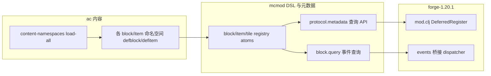

# 项目总结：架构、重构与迁移

本文档合并自项目完成总结、平台中立化重构总结与 Java→Clojure 迁移报告。**当前默认交付与 CI 目标为 Forge 1.20.1**；Fabric 适配代码存在于 `fabric-1.20.1/` 但未纳入根 `settings.gradle`（见根目录 `settings.gradle` 注释）。

---

## 一、项目概览

### 构建与模块

- **Gradle 多项目**（根 `settings.gradle`）：`api`、`mcmod`、`ac`、`forge-1.20.1`。
- **`api`**：对外 Java API（Capability/Event 等 compile-only 表面），供可选互操作；无 Clojure。
- **`mcmod`**：平台无关协议、DSL、元数据与 GUI/网络抽象；**禁止**引用 `net.minecraft.*`。
- **`ac`**：游戏内容与业务逻辑（方块/物品/无线/能量等）；仅通过 `mcmod` 协议与世界交互；**禁止**直接引用 Forge/Fabric/Minecraft。
- **`forge-1.20.1`**：Forge 入口、注册、DataGenerator、协议实现；实现 `mcmod` 协议。
- **依赖红线**：`ac` 与 `forge-1.20.1` **互不引用**；二者均依赖 `mcmod`（及 `api` 在需要处）。

历史文档中的 **「core」** 已拆分为上述 **`mcmod` + `ac`**，请勿再使用「core 模块」指代当前仓库。

### 数据流（DSL → 注册 → 游戏）

- **`mcmod`** 中的 **`defblock`/`defitem`/`deftile`** 只往各自 **atom registry** 写元数据；**不**直接碰 Minecraft。
- **`cn.li.mcmod.protocol.metadata`** 聚合查询，供 Forge/Fabric 注册循环使用。
- **`ac`** 通过 **`content-namespaces`** 统一 `require` 内容命名空间，触发 DSL 副作用；**`cn.li.ac.core/init`** 在 `lifecycle` 中注册，由 **`forge1201.init`** 在设置版本号后执行。
- 事件：DSL 中的 `:on-right-click` 等由 **`block.query`** 解析并交给 **`events.dispatcher`**，平台侧不再维护独立事件同步表。

详细步骤、模块禁止项与无线方块实现模式见 **`02-architecture/Runtime_And_DSL_CN.md`**。

### 核心设计原则

- **分层解耦**：Minecraft/Forge API → Java 入口（`@Mod`）→ Clojure 适配层（`cn.li.forge1201.*`）→ `mcmod` 协议 / `ac` 内容。
- **零硬编码**：平台代码不写死具体方块、物品、GUI 名；元数据与 registry 驱动注册与事件。
- **单一真实来源**：DSL 与元数据在 `mcmod`/`ac` 中定义；新增内容尽量只改这两处。

### 迁移成果（Java → Clojure）

- 绝大部分逻辑在 Clojure；Java 保留注解、少量桥接与 DataGenerator 入口。
- Forge 1.20.1：`cn.li.forge1201.MyMod1201` 委托给 `cn.li.forge1201.mod` 等命名空间。

---

## 二、平台中立化重构摘要

- **GUI**：`cn.li.mcmod.gui.registry` / `spec`、容器 schema；Forge 侧完成 MenuType/Screen 注册（`mc1201.runtime.spi.gui-registry`）。
- **注册**：`cn.li.mcmod.protocol.metadata`、事件元数据；方块/物品由 DSL 与元数据驱动。
- **事件**：`cn.li.mcmod.events.*` + `cn.li.mcmod.block.query`；处理器直接读取 `BlockSpec :events`。
- **能量**：物品/节点等充放电统一走 **`cn.li.ac.energy.operations`**。

---

## 三、构建与运行

命令表、产物路径与 Fabric 可选说明见 **`GETTING_STARTED.md`**。摘要：

- **构建**：`.\gradlew.bat build`（在包含 `settings.gradle` 的 `minecraftmod` 目录执行）。
- **运行客户端**：`.\gradlew.bat :forge-1.20.1:runClient`。
- **Clojure 快速编译**：`.\gradlew.bat :ac:compileClojure` 或 `:mcmod:compileClojure`。
- **DataGenerator**：`.\gradlew.bat :forge-1.20.1:runData`；详见 `04-datagen/DataGenerator.md`。
- **Fabric**：若已在 `settings.gradle` 中 `include 'fabric-1.20.1'`，再使用 `:fabric-1.20.1:runClient` / `runData`（默认未启用）。

---

## 四、文档索引

- **构建速查**：[GETTING_STARTED.md](GETTING_STARTED.md)
- **工程布局与命名空间**：[PROJECT_LAYOUT.md](PROJECT_LAYOUT.md)
- **运行时与 DSL 总览**：`02-architecture/Runtime_And_DSL_CN.md`
- 架构与 BlockState：`02-architecture/BlockState_Architecture.md`
- 客户端/服务端分离：`02-architecture/CLIENT_SERVER_SEPARATION.md`
- 平台与 Fabric：`02-architecture/Platform_And_Fabric.md`
- DataGenerator：`04-datagen/DataGenerator.md`
- Wireless / GUI：`05-wireless/`、`06-gui/`
- DSL：`03-dsl/`
- 能力矩阵：`07-ability/ABILITY_FEATURE_MATRIX.md`
- 能力运行时维护（**reducer-only** 唯一写路径 / context / 守卫）：`04-systems/ABILITY_SYSTEM_MAINTENANCE.md`
- 测试范围：`testing/IMPLEMENTATION_SCOPE.md`
- Agent 工具约定：`dev/AGENT_AND_TOOLING.md`
- **历史归档（非现行权威）**：`98-archive/README.md`
