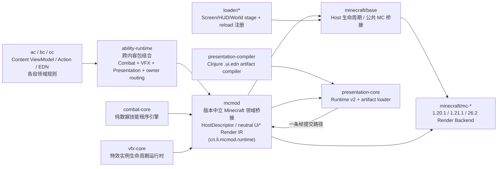

# Presentation Runtime Next 断代重构计划（实施约束版）

本文是 Presentation Runtime Next 的唯一实施约束文档。旧 UI、XML、kind renderer、overlay plan 和 script-render 链不作为新 Runtime 的 API 兼容目标；完成迁移后原子删除。
## 当前实现审计基线（2026-08-26）

以下内容是代码事实，优先于本文后面的历史实施记录：

- `presentation-core` 当前只保留 `artifact.clj`、`host_v2.clj`、`paint_v2.clj`、`runtime_v2.clj`；负责 artifact 装载、Runtime v2、Host 生命周期、状态提取和中立绘制 IR，不再包含旧 retained tree、dirty/layout/frame graph 或 Java ViewModel 类型。
- `presentation-compiler` 当前只保留 `artifact.clj` 与 `main.clj`，构建期将 `.ui.edn` 编译成严格校验的规范化 EDN artifact/manifest；不存在 `CompiledTemplate` 或运行时 `render.clj` 解释器。
- AC 当前有 7 个生产 artifact：`application`、`combat_hud`、`machine_container`、`settings`、`terminal`、`wireless_matrix`、`wireless_node`。屏幕、容器、HUD 和终端控制器均通过 `presentation-v2` 挂载；跨 Combat/VFX/Presentation 的组合由 `ability-runtime` 统一承载。
- Runtime v2 painter 已覆盖当前 artifact 实际使用的 `row/column/stack/rect/progress/text/button/image/scroll/grid/repeater/text-input/portal`；集合节点从 state 展开 item，输入节点输出中立文本/背景命令。Runtime `dispatch!` 对中立 pointer 事件执行 artifact button 命中并将 `:on/:activate` action 与 `:button-id` payload 送入 reducer，key/character/scroll 保留为 `:input/*` action。战斗 HUD controller 在进入 Runtime 前投影 `:cp-ratio/:overload-ratio/:skills/:toasts`，不再把 builder 内部字段直接暴露给 artifact。
- 帧路径是：AC snapshot → `presentation-core` Runtime v2 → `mcmod` 中立 `Ui*` Render IR → 各版本 backend；版本 backend 不读取 Core 私有状态。
- 每次变更必须验证六个真实目标的 `:platform:compileClojure`：`forge-1.20.1`、`fabric-1.20.1`、`fabric-1.21.1`、`neoforge-1.21.1`、`fabric-26.2`、`neoforge-26.2`，再执行根 `verifyCurrentPlatforms`。

## 铁律：语言边界

1. **Java 只允许定义数据格式和契约。** 允许使用 Java 的内容仅包括 `record`、不可变数据载体、枚举、接口/协议签名及其序列化所需的类型定义。事务、状态传播、reconcile、布局、事件分发、动画、VFX 生命周期、Frame Graph、编译器、批处理、资源池和性能策略必须使用 Clojure 实现。
2. **Minecraft/Forge/Fabric/NeoForge 特例。** 如果类继承 Minecraft/Forge/Fabric/NeoForge 类型，或必须使用其注解，允许在对应 `minecraft/base`、`minecraft/mc-*` 或 `loader/*` 桥接层使用 Java；该 Java 代码只能做平台入口/注解承载和数据转换，不得承载业务逻辑。
3. `presentation-core` 的 Java 源码不得引用 Minecraft、Forge、Fabric 或 NeoForge；核心行为位于同模块 Clojure namespace。`presentation-compiler`、`presentation-devtools` 的行为同样使用 Clojure。
4. Clojure 只修改 ViewModel Signal、发出 Action 或创建 Effect。运行时表现状态（hover、focus、caret、scroll、gesture、animation）由 Clojure Runtime 独占。

## 模块职责



- `presentation-core`：Clojure Runtime v2、artifact 装载、Host 生命周期、状态提取和绘制 IR；Java 侧仅保留 `HostGeometry`、`MountHandle` 等数据契约。
- `presentation-compiler`：Clojure 编译 `*.ui.edn`，构建期完成 schema/binding/action 校验并输出规范化 artifact/manifest；运行时不解释模板。
- `ability-runtime`：唯一跨内容包组合 node/combat/vfx/presentation 值、结果、帧和 owner 路由的中立层。
- `ac`：Clojure ViewModel、Action、Effect Controller 和 EDN 内容；通过 ability-runtime 使用 combat-core、vfx-core、presentation-core，保留 AC 专属业务规则，不直接调用 Minecraft 渲染 API。
- `mcmod`：版本中立的 Minecraft 领域桥接层，也是帧 ABI（`cn.li.mcmod.runtime.RenderCommand`/`RenderStage`/`RenderPass`/`FramePacket`，sealed + typed record）的唯一持有者；presentation-core 与 vfx-core 都只依赖 `mcmod`，互不依赖。负责 Host 描述、服务端权威 snapshot/delta、MenuBridge 的 slot anchor 数据、Action codec/长度限制/校验，以及 AC 与 Presentation Runtime 的中立协议。不得引用具体 loader 或版本类。
- `minecraft/base`：公共 Minecraft 生命周期和桥接；将游戏线程/资源重载/渲染阶段映射为 Runtime 调用。仅在确实需要 Minecraft 类型继承或注解时使用 Java。
- `minecraft/mc-*`：三个版本的 Render Backend；对 sealed `RenderCommand` 做 `instanceof`/`condp instance?` 分派，只消费不可变 `FramePacket`，不能修改语义或加入业务判断。
- `loader/*`：只注册 Screen、HUD、世界渲染阶段和资源重载事件，不实现 UI/VFX 业务。
- `combat-core`：纯数据技能程序引擎，永不认识 Minecraft/渲染/VFX 运行时。详见 [../04-systems/COMBAT_CORE.md](../04-systems/COMBAT_CORE.md)。
- `vfx-core`：特效实例生命周期运行时（spawn/signal/destroy、instance-key 幂等、event-seq、tombstone、seed、bounds 剔除）。详见 [../04-systems/VFX_CORE.md](../04-systems/VFX_CORE.md)。

`presentation-devtools` 模块（Inspector/热重载/性能面板）已删除——零生产调用者，`settings.gradle`/`build.gradle` 的模块注册与门禁引用一并清理。

Gradle 依赖铁律：`presentation-core -> mcmod`、`ability-runtime -> {node-core, combat-core, vfx-core, presentation-core, mcmod}`、`ac -> ability-runtime`、`minecraft/base -> mcmod`；`minecraft/base`、`loader/*` 和 `presentation-core` 之间不得建立直接依赖。平台 backend 通过 `mcmod` 提供的中立 backend/profile 数据接收 FramePacket 装配结果，避免把 Core 类型反向导入版本桥接层。

## 运行时边界

- 普通方块、物品和实体模型继续使用 Minecraft 原生渲染器。
- 战斗 HUD 接入 `HudHost`，默认穿透输入；技能轮、HUD 编辑或明确交互模式才捕获输入。
- World UI、VFX、First Person、Camera、Post FX 与 HUD 共用 Runtime v2 的 snapshot/IR 提交流程，但拥有独立 Host。
- 客户端线程拥有 AC snapshot 与 Runtime v2 状态；版本渲染线程只消费不可变中立 IR，平台桥接不持有业务状态。

## 实施顺序

1. 建立 Java 数据契约与 Clojure 核心行为，加入 Java 纯度和核心禁用 MC API 的 Gradle 门禁。
2. 同步建立 1.20.1、1.21.1、26.2 backend skeleton，并用 headless backend 做 Render IR conformance。
3. 纵向样板：战斗 HUD、Wind Generator Container、Terminal 输入/Modal、Body Intensify/Railgun 全宿主特效、一个机器世界特效。
4. 按 HUD/Screen/Container/VFX/手部相机/后处理迁移；只复用业务规则和资源，不复用旧 renderer、节点或 facade。
5. 所有目标构建和关键场景通过后，原子切换入口并删除旧 Runtime、XML loader、overlay plan、script-render runtime/compiler/executor/registry、level-effect draw-plan 和双引擎开关。

当前已落地：artifact 编译与装载、Runtime v2、Host/paint 提取、战斗 HUD、Terminal、Container/Slot MenuBridge、Settings、Wireless Matrix/Node 等 AC surface 迁移，以及六目标编译门禁。原子切换已完成，旧 HUD/Overlay/Script Render/XML 入口已删除，Presentation Runtime 是唯一自定义表现入口。

当前帧提交链：loader 初始化时只注册对应 `minecraft/mc-*` 的不透明 backend；HUD 和世界阶段回调经 `platform/neutral` 提取 `FramePacket`，再通过 `:submit!` 交给版本 backend。`mcmod` 只保存中立 profile、能力和诊断提交记录，不能读取 Core 的 Render IR；实际 GuiGraphics/BufferBuilder/后处理映射留在版本 backend 的 Clojure 桥接与允许的 Minecraft API 边界内。

Core 到版本 backend 的转换消费 `mcmod` 的中立 `Ui*` Render IR；版本 backend 只做平台绘制映射，`minecraft/base` 和 `minecraft/mc-*` 不导入 `presentation-core`。

Effect 纵向样板：AC 创建 Runtime 时编译并注册 `body_intensify.fx.edn`，每帧在客户端线程 tick，按 owner 清理，提取后的 Beam/Ribbon/Particle 等命令与 HUD 同批进入 `PresentationFrame`；旧 level-effect draw-plan 已删除。

Screen/Container 迁移边界已增加：AC host API 只返回不透明 mount token，Terminal 文本/IME/Modal 状态和 Menu/Slot 快照仍留在 AC 与服务端权威桥接内；loader/base 不接触 ViewModel、节点树或业务状态。各版本 Screen 只把键盘、字符和鼠标事件规范化为中立 map，经 `platform/neutral` 转交 AC，再由 Clojure 将中立 map dispatch 到 Runtime v2；版本边界不直接依赖 Core 类型。

六平台构建门禁：每次 Presentation Runtime 变更都必须完成以下六个目标的完整
Gradle `:platform:compileClojure` 构建（使用目标对应的 Gradle/toolchain profile），
不得只验证单一默认目标：`forge-1.20.1`、`fabric-1.20.1`、`fabric-1.21.1`、
`neoforge-1.21.1`、`fabric-26.2`、`neoforge-26.2`。构建前后还必须通过
`verifyCurrentPlatforms`，该任务包含依赖方向、Java 纯度、loader hook 和原子切换门禁。

## 验收门槛

- Java 纯度检查：核心 Java 仅数据/契约；Minecraft 特例 Java 必须位于桥接层并有明确注解/继承理由。
- 核心行为测试：artifact schema、Runtime v2 状态提取、Host mount/unmount、Action dispatch、MenuBridge、Render IR 与六目标编译。
- 性能：中端机器战斗场景 Presentation CPU p95 ≤ 1 ms，压力场景 ≤ 2 ms；静态 HUD 热身后 ≤ 256 B/frame；动态 HUD ≤ 8 KiB/frame；普通 HUD ≤ 8 draw calls，技能轮 ≤ 16。

### 最终量化验收表（硬门槛）

| 验收项 | 要求 |
| --- | ---: |
| 活跃 Surface | 23/23 |
| 容器映射 | 11/11 |
| Artifact 加载 | 23/23 |
| Controller load | 23/23 |
| Backend 指令覆盖 | 100% |
| compiler 运行时依赖 | 0 |
| 旧 ViewModel/API 引用 | 0 |
| 旧模板和 fallback | 0 |
| 未变化帧 layout/paint 重建 | 0 |
| 运行时 `.ui.edn` 读取 | 0 |

**统计口径与执行方式：**

- `23` 个逻辑 Surface = 12 个 Application/HUD controller mount + `ac.gui.manifest/gui-definitions` 中的 11 个容器 GUI；共享同一个 artifact 的多个应用仍按独立 Surface 计数。
- `11/11` 容器映射要求每个 GUI manifest 条目都有 `screen-factory-fn-kw`、`container-fn`、`screen-fn` 和 MenuBridge 路径。
- `23/23` Artifact 加载要求每个逻辑 Surface 都能解析到编译 manifest 中的 7 个物理 artifact 之一；这是逻辑实例数，不是 `.ui.edn` 文件数。
- `23/23` Controller load 要求每个 Surface 都有可解析的 controller；同一 controller 可被多个运行时实例复用，但清单按逻辑 Surface 计数，避免把模式切换误算为新增 Surface。
- `Backend 指令覆盖 100%` 要求三套版本 backend 对 `RenderCommand` sealed ABI 的全部 17 种指令都有显式分派；由 `mcmod:presentation_backend_test` 与六目标 `:platform:compileClojure` 共同验收。
- `compiler 运行时依赖 = 0`、`旧 ViewModel/API 引用 = 0`、`旧模板和 fallback = 0`、`运行时 .ui.edn 读取 = 0` 由 `verifyPresentationRuntimeZeroResidues` 扫描依赖、生产源码、旧资源根和运行时读取路径。
- `未变化帧 layout/paint 重建 = 0` 由 Runtime 的 dirty/cache 机制保证：首次提取或状态/几何变化才执行 paint，clean frame 复用已缓存命令；`runtime-v2-test` 有回归断言。

源码清单位于 `ac/src/main/clojure/cn/li/ac/gui/presentation_surface_manifest.clj`，数量回归断言位于
`ac/src/test/clojure/cn/li/ac/gui/manifest_test.clj`。执行以下门禁即可复核本表：

```text
gradlew.bat :ac:checkClojure :ac:compilePresentationViews verifyPresentationArtifacts verifyPresentationSurfaceCoverage
gradlew.bat verifyCurrentPlatforms
```

# 历史实施记录（仅作审计证据，不是当前模块清单）

下文保留此前迁移阶段的决策、门禁和性能目标；若与“当前实现审计基线”冲突，以当前代码和基线为准。

# Implementation invariants (locked)

- `mcmod` is the only version-neutral Minecraft/domain bridge shared by the
  runtime and platform base.
- The dependency seam is deliberately two-legged:

  | module | allowed dependency | responsibility |
  | --- | --- | --- |
  | `presentation-core` | `mcmod` | Presentation Runtime behaviour in Clojure; Java only contracts/data shapes |
  | `minecraft/base` | `mcmod` | Minecraft lifecycle/host bridge; no Presentation Runtime implementation |
  | `ac` | `presentation-core` (and `mcmod` for domain hooks) | ViewModel, Action, Effect Controller and EDN |
  | `minecraft/mc-*` | `mcmod` plus Minecraft version APIs | Render Backend boundary |

  `minecraft/base` and `presentation-core` must never depend on each other,
  either directly or through a compatibility facade.  In particular, a
  platform target must not add `project(":presentation-core")`; it consumes
  the neutral `mcmod` contracts and receives opaque Presentation callbacks
  from the content side.  The `verifyPresentationDependencyDirection` Gradle
  gate checks this rule in every convention script and source tree.
- `ac -> presentation-core` owns application ViewModels, Actions, Effect
  Controllers and EDN content. Loader modules receive opaque bridge values and
  only register Minecraft callbacks.
- Java in Presentation modules is limited to data contracts and serialization
  shapes. Java in Minecraft/loader modules is permitted only for Minecraft,
  Forge, Fabric or NeoForge inheritance/annotations and thin boundary
  conversion; all decisions, state propagation, reconciliation, layout,
  event routing and rendering policy remain Clojure.
- Three backend seams (`mc-1.20.1`, `mc-1.21.1`, `mc-26.2`) consume the same
  neutral frame envelope and cannot alter Render IR semantics or add domain
  logic.

`mcmod` is not a second Presentation Runtime.  It contains only neutral
  Minecraft/domain data contracts, snapshots/deltas, MenuBridge records,
  action codecs, capability metadata and host-port descriptors.  It must not
  contain UI tree reconciliation, layout, event routing, animation, VFX
  scheduling, Frame Graph policy or renderer logic.  Those behaviours live in
  Clojure in `presentation-core` and are exposed to Minecraft through opaque
  bridge values.

Implementation progress (current slice): loader HUD and world-after-translucent
callbacks now enter the opaque `mcbase` Presentation host seam. AC provides the
template resolver and Clojure Render IR interpreter; `presentation-core` merges
UI commands and unified Effect passes into the immutable `FramePacket`. The old
overlay host, XML loader, `mcmod/ui`/`uipojo`, and Clojure script-render
compiler/runtime/executor/registry have been removed; Presentation callbacks
are now the only custom UI/HUD entry path. Wind
Generator, Solar Generator, Phase Generator, Imag Fusor, Ability Interferer,
Metal Former, Energy Converter, Wireless Matrix and Wireless Node now use the
Presentation Container boundary while retaining native Menu/Slot authority.
Matrix/Node network information is exposed as typed snapshot values; editable
SSID/password/name fields use the shared textbox focus/input path and submit
through existing validated network messages.

Input follows the same neutral seam: version Screens send data maps only, and
the `presentation-core` Runtime converts them to immutable `Pointer`, `Key`,
`CharacterInput`, and `Scroll` records immediately before invoking a handler.
Terminal, Container, and future IME/Textbox hosts therefore share one version
conversion path.

Container vertical-slice invariant: the three version-specific Presentation
Container boundaries call the native `AbstractContainerScreen` render/input
super-path for slots, hover and quick-move behavior. Presentation input is
observational for slot anchors unless a future template explicitly declares
capture; server Menu/Slot state therefore remains authoritative and no client
layout/focus/animation state is synchronized back to the server.

The compiler/runtime now also supports `:button` action nodes and bounded
`VirtualList` extraction (visible rows plus overscan). Metal Former uses these
nodes for its mode controls. The compiler also emits a deterministic
magic/schema/hash/dependency-bearing template artifact; production loading can
therefore consume compiled data without executing arbitrary Clojure. Matrix/Node
network info now uses the same `:textbox` data/render leaf and host-side action
wiring.

Atomic cut-over gate: `verifyPresentationAtomicSwitch` is included in
`verifyCurrentPlatforms` and is strict by default. A local intermediate worktree
may explicitly pass `-PpresentationAtomicSwitch=false`; normal and release builds
must keep the gate enabled, which rejects
XML loaders, reactive screen entry points, overlay/draw plans, kind renderers
and script-render runtime references under AC, loader and minecraft/base.
It also rejects the old Java `mcmod/ui` and `mcmod/uipojo` runtime packages.
Minecraft-inheriting renderer shims remain permitted only as version-boundary
classes; their business decisions and effect scheduling must stay in Clojure.

Backend command coverage: all three version backends now dispatch every neutral
Render IR command kind. Native UI commands are rendered directly; world/VFX,
camera, post-process and resource-specific commands are sent to explicit
version-owned callbacks (`:draw-billboard!`, `:draw-beam!`, `:apply-camera!`,
`:apply-post-process!`, etc.) supplied in the render context. A backend may
degrade only through a declared callback/capability path, never by silently
changing IR semantics. Billboard and particle commands carry origin data in
the neutral IR, so world-space effects do not need an entity/script-render
side channel.

`*.fx.edn` 模板与 `presentation-spawn-effect!` 已不存在——VFX 内容现在经由
combat-core 技能程序的 `:vfx` op 发出信号，vfx-core 的 descriptor（`register-effect!`
登记的 `:init`/`:update`/`:sample`/`:bounds`）驱动 per-instance 生命周期。
Body Intensify 的 charge/burst 现在是这条路径的一个具体样板，见
[../04-systems/VFX_CORE.md](../04-systems/VFX_CORE.md) 与
[../04-systems/COMBAT_CORE.md](../04-systems/COMBAT_CORE.md)。

## 本轮重构落地摘要（2026-08）

以下改动来自一次以本文档为目标状态验收的具体重构（P0-1 到 P0-6，见下），
补在这里而不是散改进正文各处，方便和 git 历史对照：

1. **P0-1（Presentation UI 完全不渲染）**：`runtime.clj` 的 `host-stage` 曾把
   `HostDescriptor.HostKind` 与关键字比较，恒假，`render-mount` 从未执行。已修复；
   同时删除从未排空的 `emit!`/mount 上的 `:commands` atom。
2. **帧 ABI 统一**：`presentation-core` 原来的 sealed `RenderCommand`/`RenderStage`/
   `RenderPass`/`FramePacket`（15 个 typed record）与 `mcmod` 原来的
   `PresentationFrame/Pass/Command`（`List<Object>` 降级版，每条命令约
   150–200 B 装箱开销）两套 ABI 合并为一套：`mcmod.runtime` 下的 sealed
   `RenderCommand`，`presentation-core`/`presentation-compiler` 依赖上提为 `api`。
   三个版本 backend 的 15 路字符串 `case` 改为 `condp instance?`。
3. **per-frame 记忆化**：`extract!` 按 frame-id 记忆化并接入 `dirty`/`transaction`
   的失效判定；`neutral/presentation.clj` 的 frame-id 铸造从"每次 stage 调用递增"
   改为"每个真实帧递增一次"。
4. **世界渲染并入统一管线**：vfx-core 采样出的 batch（`merge-vfx-passes`，
   `ac/gui/reactive/register.clj`）与 UI 命令同批进入同一个 `FramePacket`，
   world-stage loader 不再维护第二条提交路径。
5. **combat-core 迁移收尾**：生产入口切到 `init-combat-ability-content!`；
   `:execution :combat-core` 让 `context_state.clj` 的 fail-closed 守卫真正生效；
   删除 legacy `defskill` 内容链（41 个主源文件 + 43 个测试文件）与
   channel 传输的死消费端（`ability/fx.clj`、`ability/effects/beam.clj`）。
6. **VFX 实例模型统一**：`effect_controller.clj` 的 aggregate 单例与 vfx-core 的
   per-instance 模型曾并存双跑；`dispatch-signal!` 现在对 combat-core 信号绕开
   vfx-core 的 `instance-key` 幂等分派，直接写入既有 aggregate 实例。4 个
   effect-id 不匹配（`:railgun`/`:mine-ray-basic`/`-expert`/`-luck` 等）一并修复。
7. **Presentation 清理与 HUD 补齐**：接线 `layout.clj` 到 `render.clj`（真实
   flex/grid/stack 布局取代此前恒定的假布局，过程中修了一个 `#{:fill nil}`
   谓词误用的真实 bug）；删除确认死亡的脚手架（`animation.clj`/`semantics.clj`/
   `render_ir.clj`/`backend.clj`/`presentation-devtools` 整个模块/
   `artifact.clj`/`reload.clj`）；消除 binding-id 表的三处手抄重复；补齐
   combat_hud.ui.edn 缺失的 ~20 个覆盖层（用一个通用 `composite-list` 叶子
   节点类型，而非每个字段一个专用节点类型）。
8. **门禁重建**：`verifyAbilityVfxRegistryCoverage`、
   `verifyPresentationContainsNoVfxRuntime`（从按关键词改为按 vfx-core 真实
   实例生命周期词汇）、`verifyPresentationJavaPurity`（覆盖上提到 `mcmod.runtime`
   的 ABI）从空壳/过宽变成会真正失败的检查。

已知未完成、明确记录而非静默略过的缺口：combat-core 的 `:query-port` 只装了
`:raycast` 一种实现（见 [COMBAT_CORE.md](../04-systems/COMBAT_CORE.md)）；
vfx-core 的 channel 传输（`register-channel!`/`dispatch-channel!`）与
combat-core 直投路径并存，尚未合并；`RenderCommand$Image` 只接受数值
`textureId`，没有 asset-path 到 texture-id 的注册表，`:src` 路径目前总是被丢弃。
