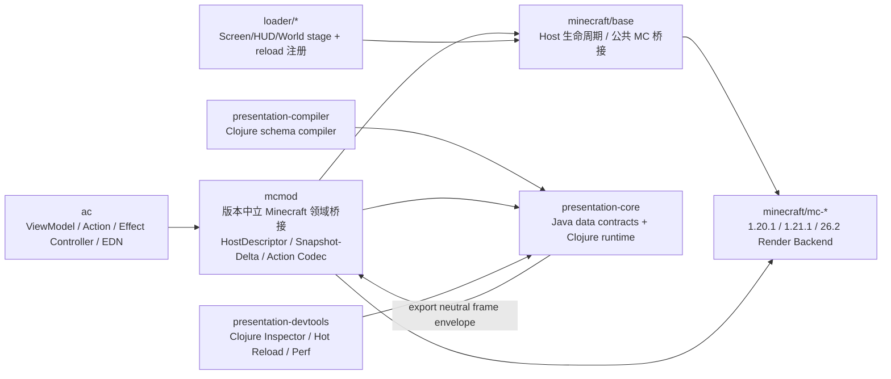

# Presentation Runtime Next 断代重构计划（实施约束版）

本文是 Presentation Runtime Next 的唯一实施约束文档。旧 UI、XML、kind renderer、overlay plan 和 script-render 链不作为新 Runtime 的 API 兼容目标；完成迁移后原子删除。

## 铁律：语言边界

1. **Java 只允许定义数据格式和契约。** 允许使用 Java 的内容仅包括 `record`、不可变数据载体、枚举、接口/协议签名及其序列化所需的类型定义。事务、状态传播、reconcile、布局、事件分发、动画、VFX 生命周期、Frame Graph、编译器、批处理、资源池和性能策略必须使用 Clojure 实现。
2. **Minecraft/Forge/Fabric/NeoForge 特例。** 如果类继承 Minecraft/Forge/Fabric/NeoForge 类型，或必须使用其注解，允许在对应 `minecraft/base`、`minecraft/mc-*` 或 `loader/*` 桥接层使用 Java；该 Java 代码只能做平台入口/注解承载和数据转换，不得承载业务逻辑。
3. `presentation-core` 的 Java 源码不得引用 Minecraft、Forge、Fabric 或 NeoForge；核心行为位于同模块 Clojure namespace。`presentation-compiler`、`presentation-devtools` 的行为同样使用 Clojure。
4. Clojure 只修改 ViewModel Signal、发出 Action 或创建 Effect。运行时表现状态（hover、focus、caret、scroll、gesture、animation）由 Clojure Runtime 独占。

## 模块职责

- `presentation-core`：Java 数据契约（Signal/FramePacket/Render IR 等）+ Clojure 事务、组件树、布局、事件、动画、Effect Runtime、Render IR、Frame Graph、帧邮箱。
- `presentation-compiler`：Clojure 编译 `*.ui.edn`、`*.fx.edn` 和 Material 模板；构建期把 binding/action 解析为数值 ID。
- `presentation-devtools`：Clojure Inspector、热重载、dirty 原因、Signal 依赖、Render Graph 和性能面板。
- `ac`：Clojure ViewModel、Action、Effect Controller 和 EDN 内容；不直接调用 Minecraft 渲染 API。
- `mcmod`：版本中立的 Minecraft 领域桥接层。负责 Host 描述、服务端权威 snapshot/delta、MenuBridge 的 slot anchor 数据、Action codec/长度限制/校验，以及 AC 与 Presentation Runtime 的中立协议。不得引用具体 loader 或版本类。
- `minecraft/base`：公共 Minecraft 生命周期和桥接；将游戏线程/资源重载/渲染阶段映射为 Runtime 调用。仅在确实需要 Minecraft 类型继承或注解时使用 Java。
- `minecraft/mc-*`：三个版本的 Render Backend；只消费不可变 FramePacket/Render IR，不能修改 IR 语义或加入业务判断。
- `loader/*`：只注册 Screen、HUD、世界渲染阶段和资源重载事件，不实现 UI/VFX 业务。

Gradle 依赖铁律：`presentation-core -> mcmod`、`minecraft/base -> mcmod`、`ac -> presentation-core`；`minecraft/base`、`loader/*` 和 `presentation-core` 之间不得建立直接依赖。平台 backend 通过 `mcmod` 提供的中立 backend/profile 数据接收 FramePacket 装配结果，避免把 Core 类型反向导入版本桥接层。

## 运行时边界

- 普通方块、物品和实体模型继续使用 Minecraft 原生渲染器。
- 战斗 HUD 接入 `HudHost`，默认穿透输入；技能轮、HUD 编辑或明确交互模式才捕获输入。
- World UI、VFX、First Person、Camera、Post FX 与 HUD 共用事务、Frame Graph 和 FramePacket，但拥有独立 Host。
- 客户端线程拥有 ViewModel、组件树和 Effect 生命周期；渲染线程只消费不可变 FramePacket；邮箱容量为 2，丢弃旧帧，不允许无界排队。

## 实施顺序

1. 建立 Java 数据契约与 Clojure 核心行为，加入 Java 纯度和核心禁用 MC API 的 Gradle 门禁。
2. 同步建立 1.20.1、1.21.1、26.2 backend skeleton，并用 headless backend 做 Render IR conformance。
3. 纵向样板：战斗 HUD、Wind Generator Container、Terminal 输入/Modal、Body Intensify/Railgun 全宿主特效、一个机器世界特效。
4. 按 HUD/Screen/Container/VFX/手部相机/后处理迁移；只复用业务规则和资源，不复用旧 renderer、节点或 facade。
5. 所有目标构建和关键场景通过后，原子切换入口并删除旧 Runtime、XML loader、overlay plan、script-render runtime/compiler/executor/registry、level-effect draw-plan 和双引擎开关。

当前已落地：Core/Compiler/Devtools 模块骨架、事务/Frame Graph/Host Runtime、UI/FX EDN 编译校验、失败热重载保留上一份有效模板、三版本 backend profile 数据、容量 2 最新帧邮箱、分层 dirty 状态、Semantics/Narration Tree、战斗 HUD ViewModel/Action 样板、Terminal ViewModel/Screen 模板、Container/Slot MenuBridge 与机器 GUI 样板、统一 Effect owner 生命周期、capture/target/bubble 输入、pointer capture、焦点和 IME 状态、`minecraft/base` Host 生命周期协议和依赖方向门禁。原子切换已完成，旧 HUD/Overlay/Script Render 入口已删除，Presentation Runtime 是唯一自定义表现入口。

当前帧提交链：loader 初始化时只注册对应 `minecraft/mc-*` 的不透明 backend；HUD 和世界阶段回调经 `platform/neutral` 提取 `FramePacket`，再通过 `:submit!` 交给版本 backend。`mcmod` 只保存中立 profile、能力和诊断提交记录，不能读取 Core 的 Render IR；实际 GuiGraphics/BufferBuilder/后处理映射留在版本 backend 的 Clojure 桥接与允许的 Minecraft API 边界内。

Core 到版本 backend 的转换在 AC/Core 边界完成为 `mcmod` 的 `PresentationFrame/Pass/Command` 数据记录。版本 backend 只消费这些中立记录，并按当前 render stage 解释 Quad、GlyphRun、Clip 等命令；因此 `minecraft/base` 和 `minecraft/mc-*` 不需要、也不得导入 `presentation-core`。

Effect 纵向样板：AC 创建 Runtime 时编译并注册 `body_intensify.fx.edn`，每帧在客户端线程 tick，按 owner 清理，提取后的 Beam/Ribbon/Particle 等命令与 HUD 同批进入 `PresentationFrame`；旧 level-effect draw-plan 已删除。

Screen/Container 迁移边界已增加：AC host API 只返回不透明 mount token，Terminal 文本/IME/Modal 状态和 Menu/Slot 快照仍留在 AC 与服务端权威桥接内；loader/base 不接触 ViewModel、节点树或业务状态。各版本 Screen 只把键盘、字符和鼠标事件规范化为中立 map，经 `platform/neutral` 转交 AC，再由 Clojure 构造 `PresentationInputEvent` 并 dispatch；版本边界不直接依赖 Core 类型。

六平台构建门禁：每次 Presentation Runtime 变更都必须完成以下六个目标的完整
Gradle `:platform:compileClojure` 构建（使用目标对应的 Gradle/toolchain profile），
不得只验证单一默认目标：`forge-1.20.1`、`fabric-1.20.1`、`fabric-1.21.1`、
`neoforge-1.21.1`、`fabric-26.2`、`neoforge-26.2`。构建前后还必须通过
`verifyCurrentPlatforms`，该任务包含依赖方向、Java 纯度、loader hook 和原子切换门禁。

## 验收门槛

- Java 纯度检查：核心 Java 仅数据/契约；Minecraft 特例 Java 必须位于桥接层并有明确注解/继承理由。
- 核心行为测试：Signal 事务、keyed reconcile、布局、事件 capture/target/bubble、IME、Effect owner 清理、Frame Graph、Render IR 三版本 conformance。
- 性能：中端机器战斗场景 Presentation CPU p95 ≤ 1 ms，压力场景 ≤ 2 ms；静态 HUD 热身后 ≤ 256 B/frame；动态 HUD ≤ 8 KiB/frame；普通 HUD ≤ 8 draw calls，技能轮 ≤ 16。

# Implementation invariants (locked)

- `mcmod` is the only version-neutral Minecraft/domain bridge shared by the
  runtime and platform base.
- The dependency seam is deliberately two-legged:

  | module | allowed dependency | responsibility |
  | --- | --- | --- |
  | `presentation-core` | `mcmod` | Presentation Runtime behaviour in Clojure; Java only contracts/data shapes |
  | `minecraft/base` | `mcmod` | Minecraft lifecycle/host bridge; no Presentation Runtime implementation |
  | `ac` | `presentation-core` (and `mcmod` for domain hooks) | ViewModel, Action, Effect Controller and EDN |
  | `minecraft/mc-*` | `mcmod` plus Minecraft version APIs | Render Backend boundary |

  `minecraft/base` and `presentation-core` must never depend on each other,
  either directly or through a compatibility facade.  In particular, a
  platform target must not add `project(":presentation-core")`; it consumes
  the neutral `mcmod` contracts and receives opaque Presentation callbacks
  from the content side.  The `verifyPresentationDependencyDirection` Gradle
  gate checks this rule in every convention script and source tree.
- `ac -> presentation-core` owns application ViewModels, Actions, Effect
  Controllers and EDN content. Loader modules receive opaque bridge values and
  only register Minecraft callbacks.
- Java in Presentation modules is limited to data contracts and serialization
  shapes. Java in Minecraft/loader modules is permitted only for Minecraft,
  Forge, Fabric or NeoForge inheritance/annotations and thin boundary
  conversion; all decisions, state propagation, reconciliation, layout,
  event routing and rendering policy remain Clojure.
- Three backend seams (`mc-1.20.1`, `mc-1.21.1`, `mc-26.2`) consume the same
  neutral frame envelope and cannot alter Render IR semantics or add domain
  logic.

`mcmod` is not a second Presentation Runtime.  It contains only neutral
  Minecraft/domain data contracts, snapshots/deltas, MenuBridge records,
  action codecs, capability metadata and host-port descriptors.  It must not
  contain UI tree reconciliation, layout, event routing, animation, VFX
  scheduling, Frame Graph policy or renderer logic.  Those behaviours live in
  Clojure in `presentation-core` and are exposed to Minecraft through opaque
  bridge values.

Implementation progress (current slice): loader HUD and world-after-translucent
callbacks now enter the opaque `mcbase` Presentation host seam. AC provides the
template resolver and Clojure Render IR interpreter; `presentation-core` merges
UI commands and unified Effect passes into the immutable `FramePacket`. The old
overlay host, XML loader, `mcmod/ui`/`uipojo`, and Clojure script-render
compiler/runtime/executor/registry have been removed; Presentation callbacks
are now the only custom UI/HUD entry path. Wind
Generator, Solar Generator, Phase Generator, Imag Fusor, Ability Interferer,
Metal Former, Energy Converter, Wireless Matrix and Wireless Node now use the
Presentation Container boundary while retaining native Menu/Slot authority.
Matrix/Node network information is exposed as typed snapshot values; editable
SSID/password/name fields use the shared textbox focus/input path and submit
through existing validated network messages.

Input follows the same neutral seam: version Screens send data maps only, and
the `presentation-core` Runtime converts them to immutable `Pointer`, `Key`,
`CharacterInput`, and `Scroll` records immediately before invoking a handler.
Terminal, Container, and future IME/Textbox hosts therefore share one version
conversion path.

Container vertical-slice invariant: the three version-specific Presentation
Container boundaries call the native `AbstractContainerScreen` render/input
super-path for slots, hover and quick-move behavior. Presentation input is
observational for slot anchors unless a future template explicitly declares
capture; server Menu/Slot state therefore remains authoritative and no client
layout/focus/animation state is synchronized back to the server.

The compiler/runtime now also supports `:button` action nodes and bounded
`VirtualList` extraction (visible rows plus overscan). Metal Former uses these
nodes for its mode controls. The compiler also emits a deterministic
magic/schema/hash/dependency-bearing template artifact; production loading can
therefore consume compiled data without executing arbitrary Clojure. Matrix/Node
network info now uses the same `:textbox` data/render leaf and host-side action
wiring.

Atomic cut-over gate: `verifyPresentationAtomicSwitch` is included in
`verifyCurrentPlatforms` and is strict by default. A local intermediate worktree
may explicitly pass `-PpresentationAtomicSwitch=false`; normal and release builds
must keep the gate enabled, which rejects
XML loaders, reactive screen entry points, overlay/draw plans, kind renderers
and script-render runtime references under AC, loader and minecraft/base.
It also rejects the old Java `mcmod/ui` and `mcmod/uipojo` runtime packages.
Minecraft-inheriting renderer shims remain permitted only as version-boundary
classes; their business decisions and effect scheduling must stay in Clojure.

Backend command coverage: all three version backends now dispatch every neutral
Render IR command kind. Native UI commands are rendered directly; world/VFX,
camera, post-process and resource-specific commands are sent to explicit
version-owned callbacks (`:draw-billboard!`, `:draw-beam!`, `:apply-camera!`,
`:apply-post-process!`, etc.) supplied in the render context. A backend may
degrade only through a declared callback/capability path, never by silently
changing IR semantics. Billboard and particle commands carry origin data in
the neutral IR, so world-space effects do not need an entity/script-render
side channel.

Body Intensify 的 charge 与 performed burst 现在都由 `*.fx.edn` 模板和
Effect Instance 驱动；释放爆发通过 typed `presentation-spawn-effect!` 进入
统一 owner 生命周期，原 scripted-effect 分支已从该样板移除。
