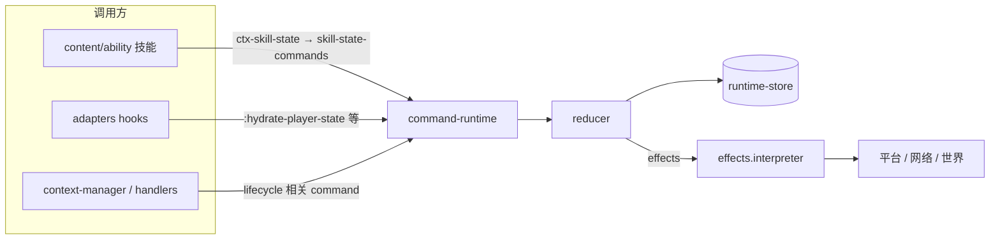

# 能力系统维护手册

> **架构基线（强制）**：能力系统**仅**使用 **reducer-only** 状态架构。一切玩家域状态变更必须经 `command-runtime` → `reducer` → `runtime-store`；禁止旁路写、禁止已删除的 `:sync-*` reducer 命令与 `context-registry` 门面。下文「Reducer-only 架构」为权威说明。

## 系统职责

能力系统负责“能力定义、触发、冷却/状态管理、平台事件接入”的统一运行框架。业务能力位于 `ac`，抽象与契约位于 `mcmod`，平台绑定位于 `forge-1.20.1`。

## Reducer-only 架构（唯一写路径）

### 原则

1. **单一写路径**：`run-command!` / `run-command-in-session!` → `reducer/apply-command` → `runtime-store` 写回；`reducer` 为纯函数（给定 state + command → 新 state + events/effects）。
2. **副作用外置**：伤害、网络包、持久化等由 reducer 返回的 `:effects` 经 `effects.interpreter` 执行，不在 reducer 内调平台 API。
3. **Context 业务字段**：`status`、`input-state`、`skill-state`、`keepalive` 等只存在于 `player-state` 的 `[:context-registry]`，仅能通过 reducer 的 context 类命令（如 `:context-assoc-skill-state`、`:update-context-status`）变更。
4. **适配器 hydration**：持久化加载、客户端 sync 推送、生命周期事件触发的域快照合并，统一用 reducer **`:hydrate-player-state`**（按 key 局部覆盖），**不得**再引入 `:sync-ability-data` 等通用 sync 命令。
5. **Tick 结算**：资源 develop、overload 等服务端 tick 逻辑在 reducer **`:server-tick`** 内完成；`state-tick` 只负责组命令与发事件，不直接改 store。

### 数据流



### 允许的直接 store 写（白名单）

| 场景 | 入口 |
|------|------|
| 正常命令提交 | `service.command-runtime` |
| 网络/持久化 effect handler | `effects.network-handler`、`effects.persistence-handler` |
| 服务端 session 清理 | `server_hooks` 生命周期（如 `remove-session!`） |

除此以外，`ac/ability` 与 `ac/content/ability` **不得**调用 `store/set-player-state!*`、`store/update-player-state!*`。

### 已废止的模式（勿恢复）

- `update-context!`、`command-runtime-ready?`、`safe-context-data` 等旧 context 直写 API
- reducer `:sync-*-data`、`:apply-server-tick-postprocess`
- `cn.li.ac.ability.service.context-registry` 命名空间（纯转发）
- 在技能或 handler 内直接 `assoc` player-state / context-registry

## Runtime owner（canonical，2026-06）

能力运行时与 context 传输使用 **canonical owner**，由 `cn.li.mcmod.runtime.owner` 统一校验与派生：

| API | 用途 |
|-----|------|
| `require-server-owner` / `require-client-owner` | 平台边界构造后校验 |
| `store-session-id` | `runtime-store` 分区（`:server-session-id` / `:client-session-id`） |
| `route-key` | context 传输路由（同 store 下按 player 隔离相同 `ctx-id`） |
| `attach-transport-owner-metadata!` / `public-context` | 传输层私有 `:owner/*` 元数据；返回给技能/内容的 context **不得**含 session 或 route 字段 |

**禁止**在 `ac/ability` 与 `ac/content/ability` 使用已废止的 `{:session-id ...}` owner 或从 context map 解构 `:session-id`。技能回调入口由 `context-state` / dispatcher 绑定 `ctx/*context-owner*`，内容层可继续只传 `ctx-id`。客户端 ability RPC（`client.api`）首参必须为 canonical client owner。

命令 map 上的 `:session-id` 字段（`command-runtime` 注入的 store 分区）与 owner map 无关，勿混用。

Context 生命周期清理仅使用 `ctx/clear-store-session-contexts!` 与 `ctx/clear-owner-contexts!`；**无** `clear-session-contexts!` 等旧别名。

## 模块边界

- `mcmod/ability`：能力抽象与通用协议（无 AC 业务 wire id 硬编码）。
- `ac/ability`：能力运行时、reducer、context、effects、适配器与注册表。
- `ac/content/ability`：各技能实现（`defskill`、pattern 回调）。
- `forge1201`：Forge 事件/生命周期适配；经 `runtime_bridge` 安装 AC hooks。
- 禁止将平台 API 侵入 `ac` 与 `mcmod`。

## 运行时流程

1. 平台层调用 `cn.li.ac.core.init/init`，创建并注入 Ability RuntimeContainer。
2. `adapters.runtime-bridge/install-runtime-hooks!` 安装 category/skill/event、context dispatcher、server/client hooks。
3. 能力内容经 discovery（scanner + `ac/ability/providers.edn`）加载技能命名空间。
4. **写路径**：`command-runtime` → `reducer` → `runtime-store`；副作用由 `effects.interpreter` 执行。
5. 需要时经 `mcmod.hooks.core` 同步 descriptor 向客户端推送 ability/resource/cooldown/preset 切片。

## 当前架构基线（2026-06，reducer-only）

### 状态与命令

| 层级 | 命名空间 / 键 | 职责 |
|------|----------------|------|
| 玩家状态切片 | `runtime-store`、键 `[:context-registry]` | 业务 context 字段 SSoT：`status`、`input-state`、`skill-state`、`keepalive` 等 |
| 命令入口 | `service.command-runtime` | 唯一命令执行壳；写 store |
| 纯函数归约 | `service.reducer` | `apply-command` / `apply-commands` |
| 副作用 | `effects.*` + `effects.interpreter` | 网络、持久化、几何/伤害等 |
| Hydration | reducer `:hydrate-player-state` | 适配器/持久化按 key 局部覆盖 player-state；**无** `:sync-*-data` 通用命令 |
| 玩家运行时切片 | `player-state` → `[:runtime ...]` | 跨技能会话状态（延迟弹射、辐射标记、vecmanip 仲裁/反射）；**禁止** content 级 atom runtime bundle |
| 运行时命令壳 | `service.player-runtime-commands` | 对 reducer 的 `:schedule-delayed-projectile-task`、`:mark-radiation-target`、`:claim-projectile` 等封装；非第二套状态源 |

#### `[:runtime]` 键（服务端 player-state）

| 路径 | 命令（节选） | 用途 |
|------|----------------|------|
| `[:runtime :delayed-projectiles :pending-tasks <player-uuid>]` | `:schedule-delayed-projectile-task`、`:tick-delayed-projectile-tasks`、`:clear-delayed-projectile-tasks` | ElectronBomb / ScatterBomb 延迟结算 |
| `[:runtime :meltdowner :radiation-marks <target-id>]` | `:mark-radiation-target`、`:clear-radiation-marks`、`:tick-radiation-marks` | RadIntensify 目标标记（写在攻击方 player-state） |
| `[:runtime :vecmanip :projectile-claims]` | `:claim-projectile`、`:replace-projectile-claims`、`:clear-player-projectile-claims` | VecDeviation / VecReflection 同 tick 弹射物仲裁 |
| `[:runtime :vecmanip :reflection]` | `:enter-vec-reflection`、`:leave-vec-reflection`、`:set-vec-reflection-depth`、`:reset-vec-reflection-runtime` | 反射链深度与重入保护 |

**已删除**：`content/ability/server_runtime_lifecycle.clj` 及 `create-*-runtime` / `install-*-runtime` 技能业务 atom bundle。`server_hooks` 会话清理走 `player-runtime-commands/reset-all-content-runtimes!`。

### Context 运行时（无 `context-registry` 门面）

已删除 `cn.li.ac.ability.service.context-registry`（纯转发层）。**同一能力只通过下表入口访问**：

| 模块 | 路径 | 何时使用 |
|------|------|----------|
| `context-domain` | `service/context_domain.clj` | 状态机常量、校验、系统属性 |
| `context-dispatcher` | `service/context_dispatcher.clj` | **Lifecycle + 合并读**：`register-context!`、`terminate-context!`、`get-context`（transport + store 投影）、路由/缓冲 |
| `context-projection` | `service/context_projection.clj` | 仅需 store 字段、不需 transport shell 时 |
| `context-manager` | `service/context_manager.clj` | 服务端编排：`activate-context!`、keepalive sweep、`abort-player-contexts!` |
| `context-state` | `service/context_state.clj` | 按键生命周期执行 skill 回调 |
| `context-skill-state` | `service/context_skill_state.clj` | **技能实现首选**：`get-context`、经 reducer 的 `assoc-skill-state!` 等 |
| `skill-state-commands` | `service/skill_state_commands.clj` | reducer 命令封装（供 `context-skill-state` 调用） |

### 技能回调 7 参 positional 契约

所有 `:actions` 回调（`:down!` / `:tick!` / `:up!` / `:abort!` / `:perform!` / `:activate!` / `:deactivate!` / `:cost-fail!`）使用统一 arity，**禁止 evt Map**：

```
[ctx-id player-id skill-id exp cost-ok? hold-ticks cost-stage player-ref]
```

| 参数 | 含义 |
|------|------|
| `ctx-id` | context id 字符串 |
| `player-id` | 玩家 UUID 字符串 |
| `skill-id` | 技能 keyword |
| `exp` | double，来自 ability-data |
| `cost-ok?` | boolean，`apply-cost!` 结果 |
| `hold-ticks` | long，payload 中的 hold/charge；否则 0 |
| `cost-stage` | `:down` / `:tick` / `:up` / nil |
| `player-ref` | payload 中的平台 player 对象，可为 nil |

- 契约与 pattern→action 映射：`ac/ability/service/skill_callback.clj`
- dispatch 入口：`context_state/dispatch-skill-callback!`（`:instant` key-down → `:perform!`；`:toggle` → `:activate!`/`:deactivate!`）
- `:cost` / `:cooldown-ticks` 动态 fn：`(fn [player-id skill-id exp] ...)`
- FX payload fn 仍可使用 map（低频）；技能逻辑回调不得重建 evt Map

**调用约定（`ac` / `content/ability`）**

- `require` 传输与 lifecycle：`[cn.li.ac.ability.service.context-dispatcher :as ctx]`。
- 技能内读 context、写 skill-state：`[cn.li.ac.ability.service.context-skill-state :as ctx-skill]`。
- **禁止**：`context-registry`、`ctx-reg/`、`update-context!`、`command-runtime-ready?`、`safe-context-data`。
- **禁止旁路写 store**：除 `command-runtime`、持久化/网络 effect handler、server lifecycle 清理外，业务不得 `store/set-player-state!*`。

### 平台适配

| 模块 | 职责 |
|------|------|
| `adapters.runtime-bridge` | 一次性安装 hooks、sync/persistence descriptor |
| `adapters.server-hooks` | 服务端 tick、生命周期、`:hydrate-player-state` |
| `adapters.client-ui-hooks` | 客户端 sync 推送、HUD、context 消息 |
| `adapters.client-effect-hooks` | 客户端 FX hooks |

### 客户端 FX handler 签名（扁平）

Level 与 Hand 效果统一使用 `:enqueue-state-fn` / `:tick-state-fn`（已删除 `:enqueue-fn`、`:tick-fn`、`:enqueue-event-fn` 与 per-event map 路由）：

| 键 | 签名 |
|----|------|
| `:enqueue-state-fn` | `(fn [state ctx-id channel owner-key payload] → state')` |
| `:tick-state-fn` | `(fn [state] → state')` |
| `:build-plan-fn` | `(fn [camera-pos hand-center-pos tick] → plan)`；`mine_detect` 等为 4 参 `(fn [... tick query-nearby-blocks-fn] → plan)` |
| `:transform-fn` | `(fn [] → transform-map\|nil)` |

公共 API：`enqueue-level-effect!` / `enqueue-hand-effect!` 为 `(effect-id ctx-id channel payload & {:keys [owner-key]})`；`owner-key` 仅在 infra 内计算一次。`fx-spec/register!` channel handler 直接传扁平参数，不再 `build-event` / `enqueue-event`。

### 其他基线

- **Server tick**：develop tick/completion 在 reducer `:server-tick` 内结算；`state-tick` 只编排命令与事件发射。
- **Runtime 安装**：禁用 `alter-var-root`；registry 使用 atom + 显式 `install-*-runtime!`。
- **服务端效果实现**：`cn.li.ac.ability.effects.*`（已删除 `ability/server/effect/*` 重复源文件）。
- **Discovery**：`cn.li.ac.discovery.scanner` + `ac/src/main/resources/ac/ability/providers.edn`，初始化后 freeze。

## 已删除的兼容层（勿回潮）

Gradle `verifyDeletedCompatibilityResidues` 与 `architecture-guard-test` 会拦截下列回归：

| 已删除项 | 替代 |
|----------|------|
| `service/context_registry.clj` | `context-dispatcher`（`:as ctx`） |
| reducer `:sync-ability-data` 等 `:sync-*-data` | `:hydrate-player-state`（仅适配器） |
| `:apply-server-tick-postprocess` | `:server-tick` 内结算 |
| `ability/server/effect/*` 测试路径 | `ability/effects/*-test` |
| `content/ability/server_runtime_lifecycle.clj` | reducer `[:runtime]` + `player-runtime-commands` |
| 技能 map 裸 `def`、未执行的 `:on-down` / `:on-tick` | `defskill` + `:actions` |
| `ctx-reg/update-context!` 等旁路 mutation API | `context-skill-state` + reducer |

## 关键守卫与回归

### Gradle

```text
cmd /c .\gradlew.bat :ac:compileClojure
cmd /c .\gradlew.bat verifyAbilityArchitectureStrict
cmd /c .\gradlew.bat verifyAbilityNoDispatcherBusinessApiUsage
cmd /c .\gradlew.bat verifyCleanupResidueGuards
cmd /c .\gradlew.bat "-Dac.test.only=cn.li.ac.ability.architecture-guard-test" :ac:runAcClojureTests
cmd /c .\gradlew.bat runAcUnitTests
```

| 任务 | 作用 |
|------|------|
| `verifyAbilityArchitectureStrict` | 禁止 resolver 全局、`service` 直写 store（白名单除外）、reducer-only 残留模式 |
| `verifyAbilityNoDispatcherBusinessApiUsage` | 禁止 `service.context-registry`、`ctx-reg/` |
| `verifyCleanupResidueGuards` | 聚合残留守卫（含 ability 相关子任务） |

### 测试

| 测试 | 作用 |
|------|------|
| `cn.li.ac.ability.architecture-guard-test` | `alter-var-root`、reducer-only 禁止模式、已删 `context-registry` 门面 |
| `cn.li.ac.ability.context-runtime-test` | context 协议、缓冲、投影 |
| `cn.li.ac.ability.discovery-test` / `cn.li.ac.content.ability-test` | 发现与内容加载 |

## 扩展技能（content/ability）

1. 在 `ac/content/ability/...` 使用 `defskill` / pattern 声明。
2. 读 context：`ctx-skill/get-context`；写 skill-state：`ctx-skill/assoc-skill-state!` 等（走 reducer）。
3. 终止/注册 context：`ctx/terminate-context!`、`ctx/register-context!`（lifecycle，非业务状态直写）。
4. 新技能配置：`ability/skill_config` + `verifyAbilitySkillConfigCoverage`。
5. 不在 content 中 `require` 已删除命名空间；测试 mock 使用 `cn.li.ac.test.support.context-mocks` 或 `with-redefs` `ctx/*`。

## 排障手册

| 现象 | 检查 |
|------|------|
| 能力未触发 | Forge 事件 → `runtime_bridge` 是否安装；skill/category registry |
| 无效果 / 状态不变 | 是否走 `command-runtime`；reducer 是否返回 `:rejected` |
| context 状态陈旧 | 是否误读 transport 未合并快照；应使用 `ctx/get-context` 或 `ctx-skill/get-context` |
| 客户端 HUD 不同步 | `client-ui-hooks`、wire `ability:sync/*` descriptor |
| 编译守卫失败 | 对照上文「已删除的兼容层」与 `architecture-guard-test` 输出 |

## 变更风险

- 生命周期安装顺序错误会导致 registry 未 freeze。
- `[:context-registry]` 内 map 结构变更影响存档；需迁移或兼容读。
- 修改 `ability:ctx/*` wire id 会破坏网络协议。

## 相关文档

- 功能矩阵（历史对照）：[ABILITY_FEATURE_MATRIX.md](../07-ability/ABILITY_FEATURE_MATRIX.md)
- Context 协议 V2：[ABILITY_CORE_SPEC_V2.md](../07-ability/ABILITY_CORE_SPEC_V2.md)
- Agent 构建命令：[AGENT_AND_TOOLING.md](../dev/AGENT_AND_TOOLING.md)

## 兼容性约束

- 内部 API 可按 reducer-only 基线破坏性调整；**技能 id、wire message id、NBT key** 变更需评估存档与联机兼容。
- 文档与守卫须与删除门面/命令保持同步（本文 2026-06 与 `context-registry` 移除一致）。
