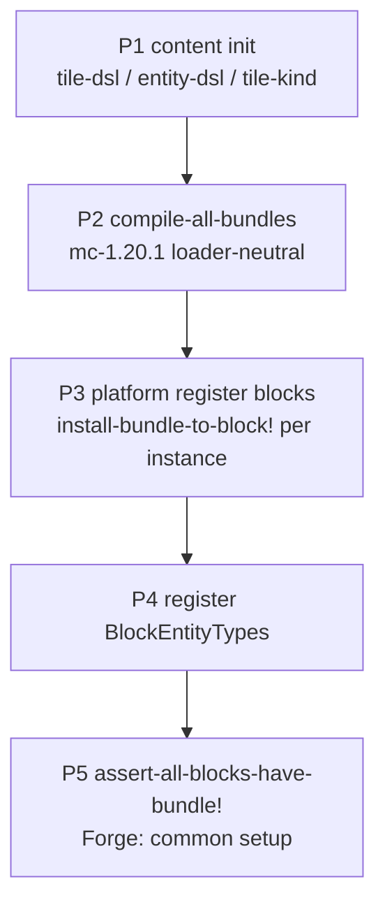

# Scripted logic dispatch (BlockEntity + Mob)

Loader-neutral compile/install pipeline in **`mc-1.20.1`**; Forge/Fabric only register types and call the pipeline. **No dual-path**: runtime must not fall back to `RT.var` or `^:dynamic` tile-logic registries.

## Tile interface contracts (`cn.li.mc1201.block.logic`)

| Interface | Method | Null field semantics |
|-----------|--------|----------------------|
| `ITileTickLogic` | `serverTick(level, pos, state, be)` | skip tick |
| `ITileNbtLogic` | `readNbt` / `writeNbt` | skip NBT hook |
| `ITileContainerLogic` | WorldlyContainer-aligned 10 methods | Forge BE returns safe defaults when null |
| `ITileCapabilityLogic` | `resolve(be, capKey, side) → Object` | Forge wraps in cached `LazyOptional` |

`TileLogicBundle` holds four nullable fields; `EMPTY` = all null.

## Mob interface contracts (`cn.li.mc1201.entity.logic`)

| Interface | Method | Semantics |
|-----------|--------|-----------|
| `IMobTickLogic` | `aiStep(mob)` | called after `super.aiStep()` |
| `IMobHurtLogic` | `onIncomingDamage` → `float` | `NaN` = cancel hurt |
| `IMobDeathLogic` | `onDie` | called before `super.die()` |
| `IMobLootLogic` | `dropLoot` → `boolean` | `true` = skip vanilla `dropFromLootTable` |

`ScriptedEntityLogicRegistry` (`IdentityHashMap<EntityType<?>, MobLogicBundle>`) is the sole mob bundle anchor.

## Registration phases (P1→P5)

- `{tile-id → bundle}` lives in a **local `let`** during registration — not `defonce`, not `^:dynamic`.
- BE hot path: `getBlockState().getBlock()` → `IScriptedBlock.getTileLogic()` → interface call (field read + `instanceof` + invokevirtual).

## BlockEntity path

1. **Declaration** (`mcmod`): `tile-dsl` / `tile-kind` — `:tick-fn`, `:read-nbt-fn`, `:write-nbt-fn`, `:container`, `:capability-keys`.
2. **Compile**: `logic-compile/compile-tile-logic` after `tile-kind/merge-tile-kind-defaults`.
3. **Install**: `logic-pipeline/install-bundle-to-block!` on each `IScriptedBlock` at block creation.
4. **Hot path**: `AbstractScriptedBlockEntity` + Forge `ScriptedBlockEntity` / capability handlers.

## Mob path

1. **Declaration**: entity DSL `:scripted-mob` + `:properties.mob` (`:mob-tick-fn`, …).
2. **Compile**: `mob-logic-compile/compile-mob-logic`.
3. **Install**: `mob-logic-pipeline/install-mob-bundle!` on `EntityType` (Forge `ModEntities` callback).
4. **Hot path**: `ScriptedMobEntity` bundle dispatch.

## Performance model

| Path | Per server tick (approx.) |
|------|---------------------------|
| Old (removed) | Var resolve + 2× registry lookup + `IFn.invoke` + Object[] boxing |
| New | Block field read + `instanceof` + one interface call, **0** alloc |

Micro-sample: `tick-microbench-test` (forge test, nanoTime smoke).

## Removed — do not reintroduce

- `mcmod.block.tile-logic` runtime registries
- `hook-registry-core` event hook registry (`call-hooks`, `register-hook!`, `*hook-registry-state*`)

Client scripted effect/ray/marker hook **classes** remain (`register-all-scripted-hooks!`).

## Module boundaries

| Layer | MC types | Loader API |
|-------|----------|------------|
| `mcmod` | no | no |
| `ac` | no | no |
| `mc-1.20.1` | yes | no |
| `forge-1.20.1` / `fabric-1.20.1` | yes | yes |

See also [PROJECT_LAYOUT.md](../01-overview/PROJECT_LAYOUT.md), [TILE_DSL_GUIDE_CN.md](../03-dsl/TILE_DSL_GUIDE_CN.md).
