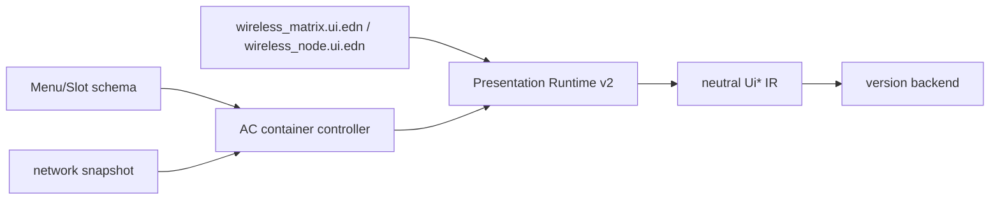

# Wireless GUI 状态与维护手册

> 状态标签：**现行**（Presentation Runtime v2）

Wireless Matrix 和 Wireless Node 的菜单协议仍由 `mcmod/gui` 的 Menu/Slot schema 管理；最终屏幕呈现统一由 AC 的 `.ui.edn` artifact 和 `presentation-v2` 控制器完成，不再使用 XML GUI。

## 现行资源与入口

| Surface | Artifact | Controller |
|---|---|---|
| Wireless Matrix | `ac/src/presentation/resources/academy/app/wireless_matrix.ui.edn` | `ac/src/main/clojure/cn/li/ac/block/wireless_matrix/gui_reactive.clj` |
| Wireless Node | `ac/src/presentation/resources/academy/app/wireless_node.ui.edn` | `ac/src/main/clojure/cn/li/ac/block/wireless_node/gui_reactive.clj` |

数据流：



控制器负责网络状态快照、按钮 action、文本字段提交和权限判断；artifact 只负责结构、绑定和语义，不直接访问 TileEntity 或网络 API。

## 维护检查

- [ ] artifact 的 `:view/id` 与 `presentation-screen-data` 的 template id 一致。
- [ ] Matrix/Node snapshot 至少提供 `network-state`、`network-owner`、`network-range`、`network-bandwidth`、`network-load` 及对应的文本字段。
- [ ] `:presentation-buttons` 的 0/1 按钮 label 能映射到 `button-left`/`button-right`。
- [ ] Menu/Slot schema、quick-move 和权限校验仍由 `mcmod/gui` 与 AC controller 负责。
- [ ] 新增 UI 字段时同时更新 `.ui.edn` 的 `:state-schema`、controller snapshot 和 compiler 校验。
- [ ] 不新增 XML、CGui renderer 或第二套 screen painter。

## 验证命令

```powershell
cmd /c .\gradlew.bat :ac:checkClojure verifyPresentationArtifacts
.\scripts\target-gradle.ps1 forge-1.20.1 :platform:compileClojure
.\scripts\target-gradle.ps1 fabric-1.20.1 :platform:compileClojure
.\scripts\target-gradle.ps1 fabric-1.21.1 :platform:compileClojure
.\scripts\target-gradle.ps1 neoforge-1.21.1 :platform:compileClojure
.\scripts\target-gradle.ps1 fabric-26.2 :platform:compileClojure
.\scripts\target-gradle.ps1 neoforge-26.2 :platform:compileClojure
```