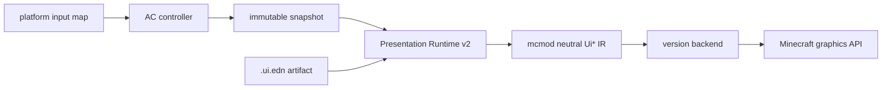

# GUI 架构

当前 GUI 采用单一 Presentation Runtime v2 呈现路径。`.ui.edn` artifact 描述 HUD、Screen、Container 的结构和绑定；`mcmod/gui` 只保留 Menu/Slot/handler 协议，不能再承担第二套 renderer。

## Layering

| Layer | Location | Responsibility |
|-------|----------|----------------|
| Artifact | `ac/src/presentation/resources/academy/app/*.ui.edn` | view schema、layout、state binding、action declaration |
| Runtime | `presentation-core/src/main/clojure/cn/li/presentation/core/*_v2.clj` | artifact loading、mount/present/unmount、state extraction、neutral UI IR |
| Protocol | `mcmod/src/main/clojure/cn/li/mcmod/gui/` | Menu spec、registry、slot schema、MenuBridge；不绘制 UI |
| Business | `ac/src/main/clojure/cn/li/ac/**` | snapshot、action、effect 和 screen/container controller |
| Minecraft version | `platform-src/minecraft/mc-*` | neutral `Ui*` IR 到各版本 GuiGraphics/Buffer 映射 |
| Loader | `platform-src/loader/*` | Screen/HUD 生命周期、资源重载与网络 glue |

## Data flow



## Rules

- `mcmod` 与 `ac` 不引用 Minecraft / Loader API。
- Loader 层不复制业务 GUI 规则，只注册生命周期并转发中立输入。
- Menu/Slot 权威仍在 `mcmod/gui` + AC container controller；最终绘制必须通过对应 artifact。
- 当前生产 artifact：`application`、`combat_hud`、`machine_container`、`settings`、`terminal`、`wireless_matrix`、`wireless_node`。
- 不兼容旧 XML、旧 CGui renderer、旧 retained tree；新增界面必须新增 `.ui.edn` artifact 和对应 controller mount。

## Verification

```powershell
cmd /c .\gradlew.bat :ac:checkClojure :presentation-core:runCoreClojureTests :presentation-compiler:runCompilerClojureTests verifyPresentationArtifacts
.\scripts\target-gradle.ps1 forge-1.20.1 :platform:compileClojure
.\scripts\target-gradle.ps1 fabric-1.20.1 :platform:compileClojure
.\scripts\target-gradle.ps1 fabric-1.21.1 :platform:compileClojure
.\scripts\target-gradle.ps1 neoforge-1.21.1 :platform:compileClojure
.\scripts\target-gradle.ps1 fabric-26.2 :platform:compileClojure
.\scripts\target-gradle.ps1 neoforge-26.2 :platform:compileClojure
```