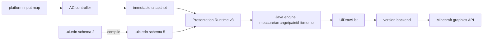

# GUI 架构

当前 GUI 采用单一 Presentation Runtime v3 呈现路径。`.ui.edn`（schema 2）artifact 描述 HUD、Screen、Container 的结构和绑定，编译为 schema 5（`:pui5`）扁平 SoA 产物；`mcmod/gui` 只保留 Menu/Slot/handler 协议，不能再承担第二套 renderer。详细的布局算法、opcode 表、事件模型、IR/后端契约见 [PRESENTATION_V3.md](PRESENTATION_V3.md)。

## Layering

| Layer | Location | Responsibility |
|-------|----------|----------------|
| Artifact source | `ac/src/presentation/resources/academy/app/*.ui.edn` | view schema、layout、state binding、action declaration |
| Compiler | `presentation-compiler/src/main/clojure/cn/li/presentation/compiler/artifact.clj` | 源语法糖降级为物理 opcode、扁平化、binding-id/dep-mask 分配 |
| Control plane | `presentation-core/src/main/clojure/cn/li/presentation/core/{artifact,nodetable,runtime}.clj` | artifact loading、mount/present/unmount、BindResolver、state extraction |
| Engine | `presentation-core/src/main/java/cn/li/presentation/core/engine/*.java` | 两趟布局（measure/arrange）、绘制（paint）、命中测试（hit）、记忆化（memo） |
| Neutral ABI | `mcmod/src/main/java/cn/li/mcmod/runtime/{ui/*,RenderCommand,FramePacket}.java` | `UiDrawList`/`UiOp`/`UiTextMetrics` 与世界/VFX `RenderCommand` |
| Protocol | `mcmod/src/main/clojure/cn/li/mcmod/gui/` | Menu spec、registry、slot schema、MenuBridge；不绘制 UI |
| Business | `ac/src/main/clojure/cn/li/ac/**` | snapshot、action、effect 和 screen/container controller |
| Minecraft version | `platform-src/minecraft/mc-*` | `UiDrawList` run 按 opcode 分发到各版本 GuiGraphics/Buffer，安装 `UiTextMetrics` |
| Loader | `platform-src/loader/*` | Screen/HUD 生命周期、资源重载与网络 glue |

## Data flow



## Rules

- `mcmod` 与 `ac` 不引用 Minecraft / Loader API。
- Loader 层不复制业务 GUI 规则，只注册生命周期并转发中立输入。
- Menu/Slot 权威仍在 `mcmod/gui` + AC container controller；最终绘制必须通过对应 artifact。
- 当前生产 artifact（15 个，见 `verifyPresentationArtifacts`）：`ability_interferer`、`application`、`combat_hud`、`developer`、`location_teleport`、`machine_container`、`media`、`preset_editor`、`settings`、`skill_tree`、`terminal`、`tutorial`、`ui_customize`、`wireless_matrix`、`wireless_node`。
- 不兼容旧 XML、旧 CGui renderer、旧 retained tree；新增界面必须新增 `.ui.edn` artifact 和对应 controller mount。
- 几何只在引擎的 measure/arrange 里算一次；paint 与 hit-test 都只读已提交的 `LayoutArena`，任何地方不得二次推导 rect（`verifyPresentationRuntimeZeroResidues` 禁止 `child-rects` 复现）。

## Verification

```powershell
cmd /c .\gradlew.bat :ac:checkClojure :presentation-core:runCoreClojureTests :presentation-compiler:runCompilerClojureTests verifyPresentationArtifacts
.\scripts\target-gradle.ps1 forge-1.20.1 :platform:compileClojure
.\scripts\target-gradle.ps1 fabric-1.20.1 :platform:compileClojure
.\scripts\target-gradle.ps1 fabric-1.21.1 :platform:compileClojure
.\scripts\target-gradle.ps1 neoforge-1.21.1 :platform:compileClojure
.\scripts\target-gradle.ps1 fabric-26.2 :platform:compileClojure
.\scripts\target-gradle.ps1 neoforge-26.2 :platform:compileClojure
```